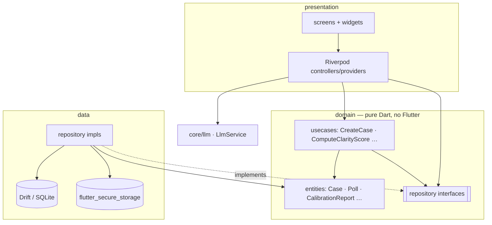
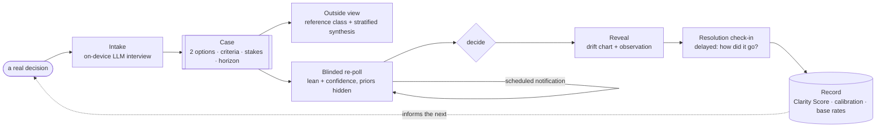
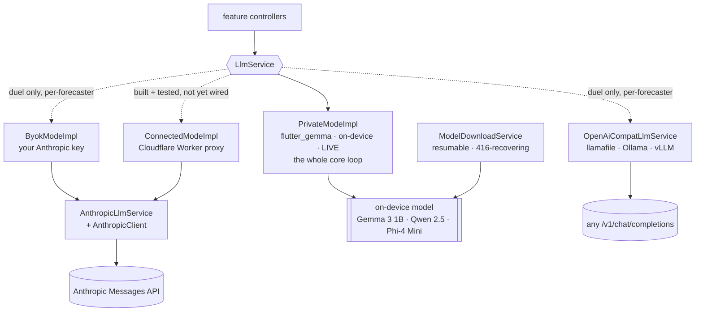
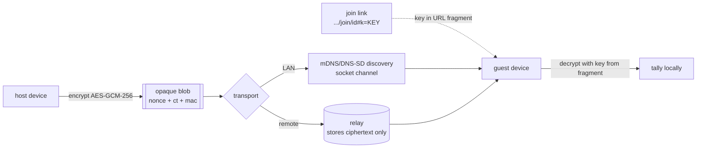

# Architecture Overview

> The one-page mental model of Reckon, then the diagrams that make it concrete. For
> *why* each load-bearing decision was made, see [`docs/adr/`](../adr/). For the
> per-subsystem reference docs, see the rest of [`docs/`](../).

## What this is, in one paragraph

Reckon is a **Flutter, Android-first, local-first decision journal**. A real decision
becomes a typed **Case**; the app runs a protocol over it (intake → blinded re-poll →
reveal → resolution) and persists everything to a local **Drift/SQLite** database with
no server. A small **on-device LLM** (via `flutter_gemma`) does the language work —
interviewing, synthesising an outside view, observing drift — behind a single
`LlmService` interface that can also be backed by a cloud model (BYOK/Connected). The
**record** (Clarity Score, calibration) is computed from closed cases *on query*, never
stored. A separate mode, **ReckonParty**, does group voting and syncs opaque encrypted
blobs over the LAN or an optional relay. The code is Clean Architecture, feature-first.

## The layers (Clean Architecture, feature-first)

Read this and you understand how any screen reaches storage or the model.

Two rules hold everywhere:

1. **`domain/` is pure and testable** — no Flutter, no Drift, no `flutter_gemma`
   imports. Entities and usecases are plain Dart; that's why the record maths and the
   voting tallies are unit-tested in isolation.
2. **Everything crosses a repository interface.** Presentation talks to `domain`
   interfaces; `data/` implements them over Drift or secure storage. Swap the backing
   store (or the LLM backend) without touching a screen.

Each feature (`case`, `outside_view`, `reveal`, `record`, `glossary`, `predictions`,
`forecasters`, `bounty`, `export`, `party`, `onboarding`) carries its own
`domain / data / presentation` trio.

## The decision loop (the single most important picture)

Every core feature is a station on one pipeline. This is the product.

- A **re-poll is blinded**: the data layer must not surface prior polls before the
  user re-answers. This is a load-bearing invariant, not a UI nicety — see
  [ADR-0006](../adr/0006-honest-record-blinded-repolls.md).
- The **record closes the loop**: closed cases feed calibration, which is what makes
  the *next* decision better-informed.

## The LLM backend (one interface, four implementations)

`LlmService` (six methods: `conductIntake`, `synthesizeOutsideView`,
`detectRepollSentiment`, `generateRevealObservation`, `generateCommunitySeed`,
`redactQuestion`) is the seam. Callers never know which model answered.

- The **core loop** (intake, outside view, re-poll sentiment, reveal) always runs on
  `PrivateModeImpl` (`llmServiceProvider` wires it; there is still no cloud switch for
  the loop). The **forecaster duel** resolves a service *per forecaster*
  (`llmServiceForForecaster`): personas share the resident on-device model; BYOK and
  OpenAI-compatible forecasters get their own HTTP backends — the only place the cloud
  runs, and only for forecasters the user created
  ([ADR-0007](../adr/0007-forecaster-duel-alignment-scoring.md)).
- Every backend returns **recoverable sentinels** on failure (empty stream, fallback
  text) — a model hiccup never crashes the app, and the duel never logs a sentinel.
- Full detail: [Model architecture](../reference/model-architecture.md) and
  [ADR-0001](../adr/0001-on-device-llm-first.md) / [ADR-0002](../adr/0002-pluggable-llm-backends.md).

## ReckonParty sync (LAN or a zero-knowledge relay)

The group mode is local-first too: a party works by passing the phone around. Remote
participation is an *opt-in* layer that moves only ciphertext.

- The **key travels in the URL fragment** (`#k=…`), which browsers never transmit — so
  the relay receives ciphertext and never the key. A breach or subpoena of the relay
  yields opaque blobs and nothing else. See
  [ADR-0004](../adr/0004-reckonparty-zero-knowledge-sync.md) and the
  [yellow paper](../spec/yellow-paper.md).
- Voting tallies (approval, ranked-choice) are pure usecases computed **on-device**;
  the relay never counts anything.

## Module map (where to look)

| Concern | Modules |
|---|---|
| **App shell / routing** | `lib/main.dart`, `lib/app/{app,router,app_shell}.dart` |
| **Decision protocol (case/poll)** | `lib/features/case/{domain,data,presentation}` |
| **Outside view** | `lib/features/outside_view/`, `lib/core/database/seed/reference_class_seeder.dart`, `assets/reference_classes.json` |
| **Reveal & resolution** | `lib/features/reveal/` |
| **Honest record** | `lib/features/record/domain/{entities,usecases}` (Clarity Score, calibration, base rates, insight cards, update quality) |
| **Forecasters / the duel** | `lib/features/forecasters/` (roster, `RunDuel`, settings section), `lib/core/llm/forecaster_llm.dart` (per-forecaster service resolution) |
| **Deference map / prediction log** | `lib/features/predictions/` (`ComputeForecasterWeights`, `/forecasters` screen, scoring in `data/prediction_repository_impl.dart`) |
| **Bounty interface (reckonBounty client)** | `lib/features/bounty/` (wire codec in `domain/bounty_codec.dart`; redaction, paste-import, `/bounty/:caseId`) |
| **Glossary / export** | `lib/features/{glossary,export}/` |
| **LLM interface + backends** | `lib/core/llm/llm_service.dart`, `private_mode_impl.dart`, `anthropic_llm_service.dart`, `anthropic_client.dart`, `byok_mode_impl.dart`, `connected_mode_impl.dart`, `llm_providers.dart`, `llm_prompts.dart` |
| **Model download / specs** | `lib/core/llm/model_download_service.dart`, `model_spec.dart`, `hf_token.dart`, `model_error.dart` |
| **Data model / storage** | `lib/core/database/` (`app_database.dart`, `tables/`, `converters.dart`) |
| **Auth (Ghost)** | `lib/core/auth/` |
| **Notifications** | `lib/core/notifications/` (repoll schedule, stable ids) |
| **ReckonParty — voting** | `lib/features/party/domain/usecases/compute_{approval,ranked}_result.dart` |
| **ReckonParty — groups** | `lib/features/party/` (`Groups`/`GroupMembers` repos, `/groups` + `/group/:id` screens, considered-mode gating in the result screen) |
| **ReckonParty — crypto/sync** | `lib/features/party/sync/` (`party_crypto.dart`, `party_relay.dart`, `party_link.dart`, `party_codec.dart`, `party_sync_service.dart`) |
| **ReckonParty — LAN transport** | `lib/features/party/sync/transport/` |
| **Relay server** | `relay/` (standalone Dart + shelf; `relay/lib/relay.dart`) |
| **Design system / theme** | `lib/shared/theme/` (blessed app identity: `ReckonTheme`, `ReckonAccents`, tokens), `lib/shared/widgets/`, `lib/core/theme/` |

## Invariants that must always hold

These are the rules the whole design depends on. Breaking one is a design regression,
not a feature.

1. **The model never decides.** It structures, observes, and — in the duel — forecasts;
   but a forecast stays sealed until the user's own decision is on record, and its only
   authority is its scored track record. The verdict is the user's.
2. **Ghost runs offline with no account.** The only network call is the HTTPS model
   download. No telemetry, no analytics, no required sign-in. (A duel against a BYOK or
   OpenAI-compatible forecaster is the user's explicit, per-forecaster opt-in.)
3. **The record is honest.** Clarity Score, calibration, and the deference map are
   computed from closed cases on query, never stored or inflated; re-polls are blinded;
   the one persisted score is the per-forecast alignment score (a log entry, not a
   metric — yellow paper R4).
4. **The relay only ever holds ciphertext.** Encryption is on-device; the key stays in
   the join link's fragment and never reaches a server. Group names and member ids ride
   only inside encrypted blobs.
5. **Cloud is opt-in and key-is-yours.** A cloud backend runs only against a
   user-supplied key or a user-chosen proxy; no key is baked into the binary.
6. **Nothing leaves without a preview.** A bounty export exists only as a file the user
   reviewed and shared themselves; the app is never the transport
   ([ADR-0009](../adr/0009-bounty-client-paste-import.md)).
